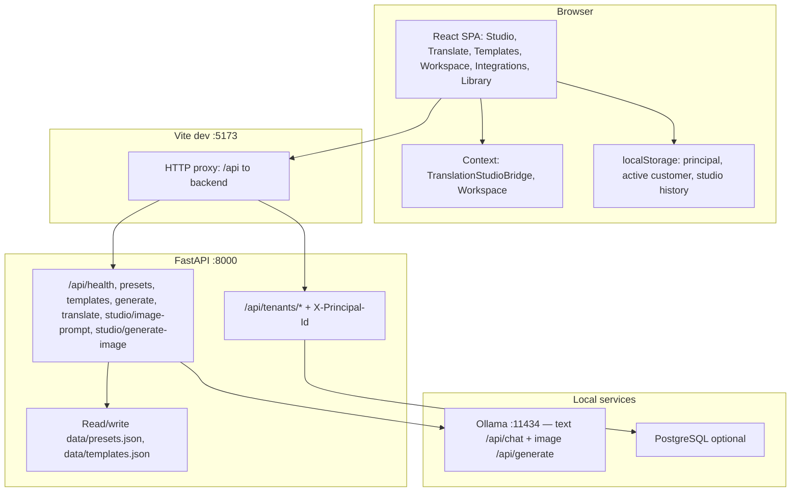
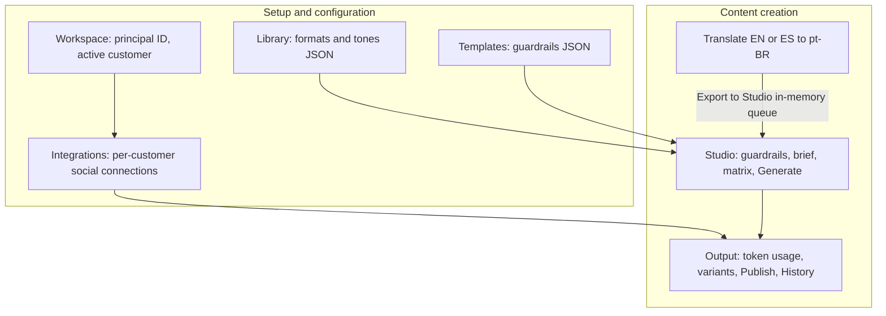
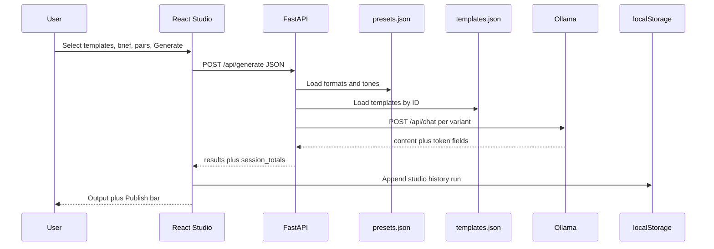
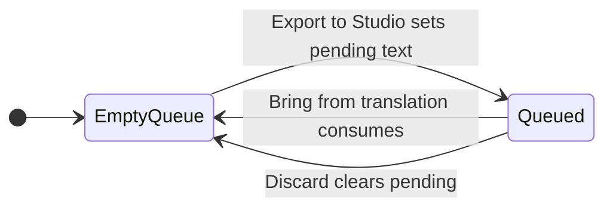
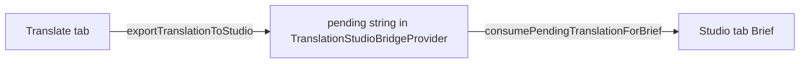
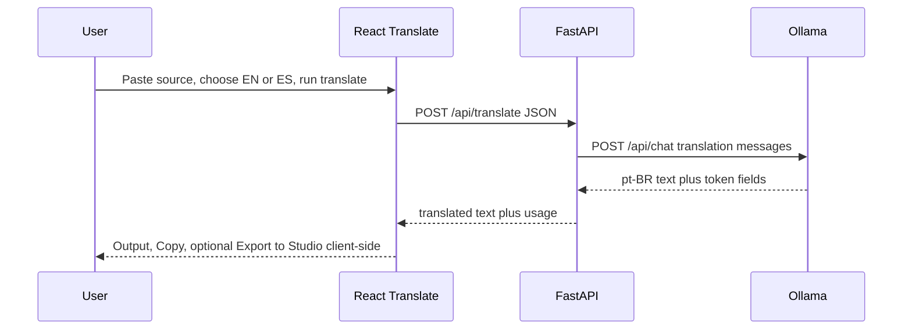
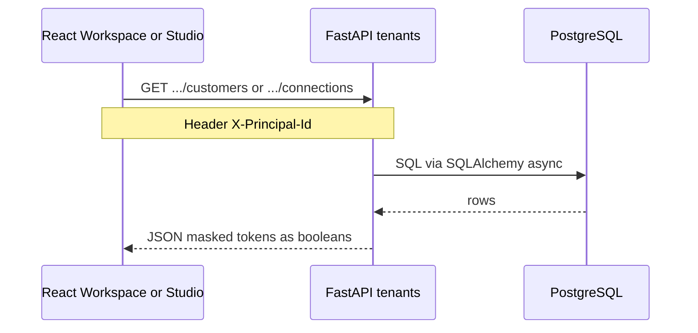
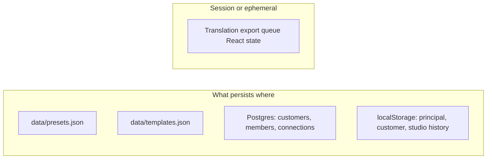

# GIGI-AI

**GIGI-AI** is a local-first **WebUI** for social content, powered by **Qwen 14B** (via [Ollama](https://ollama.com)): **formats** and **tones** from `data/presets.json`, plus optional **guardrail templates** from `data/templates.json`. Includes **Translate to pt-BR** for **English or Spanish** source text, and **Studio** optional **images** via a second Ollama model (default **`x/z-image-turbo`** — see [docs/IMAGE_GENERATION.md](docs/IMAGE_GENERATION.md)).

## Documentation

| Resource | What it is |
|----------|------------|
| **[docs/USER_GUIDE.md](docs/USER_GUIDE.md)** | **Frontend / product walkthrough** — same order and wording as the live UI (sidebar, Studio steps, Translate, Templates, Library, tokens, troubleshooting). |
| **[docs/INSTALLATION.md](docs/INSTALLATION.md)** | **Full installation guide** — OS, Git, Ollama, model, Python packages, Node/npm packages, fonts, scripts, verification. |
| **[docs/README.md](docs/README.md)** | Index of the `docs/` folder. |
| **[docs/EXECUTIVE_OVERVIEW.md](docs/EXECUTIVE_OVERVIEW.md)** | **PRD em pt-BR** — requisitos (FR/NFR), resumo de API, roadmap, riscos e capacidade. |
| **[docs/LOCAL_POSTGRES.md](docs/LOCAL_POSTGRES.md)** | Optional **PostgreSQL** for Phase 4 (customers + social connections): Docker, Alembic, `/api/tenants/*`. |
| **[docs/INTEGRATIONS_PLATFORMS.md](docs/INTEGRATIONS_PLATFORMS.md)** | **Integrations contract** — platform-specific IDs (LinkedIn URNs, Meta Graph IDs, X user ids) and vendor doc links. |
| **[docs/IMAGE_GENERATION.md](docs/IMAGE_GENERATION.md)** | **Studio images:** `OLLAMA_IMAGE_MODEL` (default `x/z-image-turbo`), `ollama pull`, verification, Qwen-Image vs Ollama. |
| **This README (below)** | **Architecture, data flows, and user journeys** — Mermaid diagrams for system context, Studio, Translate, tenant API, and persistence. |

## Architecture, data flows, and user journeys

This section is the **map of the product**: who touches what, where data lives, and how requests move through the stack. Diagrams use [Mermaid](https://mermaid.js.org/) (GitHub renders them in the README; other viewers may need a Mermaid-capable preview).

### System context

High-level components: the **browser** runs the React app; in development, **Vite** proxies `/api` to **FastAPI**. Inference hits **Ollama**; tenant data hits **PostgreSQL** when configured; **formats, tones, and templates** are JSON files on disk unless you only read them through the API.



**Production-style run:** build the frontend so `frontend/dist/` exists; FastAPI can serve the SPA at `/` while still exposing `/api/*` (see [Production-style single server](#production-style-single-server)).

### User journeys (navigation and intent)

How the **sidebar areas** relate: content authors usually tune **Library** (formats/tones) and **Templates**, then work in **Studio**. **Translate** can feed **Studio** via the export bridge. **Workspace** picks the tenant customer; **Integrations** registers social accounts for that customer (used for publish shortcuts in Studio today; API publish is future work).



### Studio generation data flow

Each **Generate** call sends the brief, selected format/tone pairs, template IDs, output language, and temperature. The backend resolves presets and templates, builds chat messages, calls Ollama once per variant, aggregates token counts, and returns all blocks. The UI persists a snapshot to **generation history** in `localStorage` (scoped by active customer id when set).



### Translate to Studio bridge (no server round-trip)

The bridge is **client-only React state**: exporting from Translate does not call the API; it queues text and switches to Studio. **Bring from translation** pastes into the brief and clears the queue.





### Translation inference data flow

**Translate** uses the same Ollama stack as Studio, but a dedicated prompt and **`POST /api/translate`**. Export to Studio is **not** shown here—that path stays in the browser (see above).



### Tenant API and integrations data flow

Workspace stores **principal** and **active customer** in `localStorage`. Calls to `/api/tenants/...` send header **`X-Principal-Id`**. The backend checks membership, reads/writes **PostgreSQL** (customers, members, social connections). Studio loads connections for the same customer to render **Publish** (copy + open composer); server-side posting to networks is not implemented yet.





### End-to-end checklist (mental model)

| Layer | Responsibility |
|-------|----------------|
| **React** | Navigation, forms, bridge context, `localStorage` for workspace + history, `tenantApi` header injection |
| **Vite proxy** | Same-origin `/api` during dev |
| **FastAPI** | REST, preset/template CRUD, generation and translate orchestration, tenant CRUD when `DATABASE_URL` is set |
| **Ollama** | Local inference: **`/api/chat`** (text) + **`/api/generate`** (image model from `OLLAMA_IMAGE_MODEL`) |
| **PostgreSQL** | Optional multi-tenant metadata and integration rows |
| **JSON files** | Authoring surface for presets and templates (also editable in UI where implemented) |

For step-by-step product copy aligned with the UI, see **[docs/USER_GUIDE.md](docs/USER_GUIDE.md)**. For install commands, see **[docs/INSTALLATION.md](docs/INSTALLATION.md)**. For image model tags and deployment checks, see **[docs/IMAGE_GENERATION.md](docs/IMAGE_GENERATION.md)**.

**One-command setup (macOS / Linux):** after cloning, run **`./scripts/install-all.sh`** (installs Ollama if missing, pulls the **text** and **image** default models, creates `backend/.venv`, runs `npm install`, copies `.env`). See [docs/INSTALLATION.md](docs/INSTALLATION.md) for options and Windows notes.

## Prerequisites

1. **Ollama** installed and running (`ollama serve` is usually automatic after install).
2. Pull a Qwen 14B-class **text** model (name must match `OLLAMA_MODEL` in `backend/.env`):

   ```bash
   ollama pull qwen2.5:14b
   ```

   Other tags (for example `qwen2.5:8b` or `qwen2.5:7b`) work if you set `OLLAMA_MODEL` accordingly.
3. Pull the **image** model for Studio (**`OLLAMA_IMAGE_MODEL`**, default **`x/z-image-turbo`**):

   ```bash
   ollama pull x/z-image-turbo
   ```

   Details: [docs/IMAGE_GENERATION.md](docs/IMAGE_GENERATION.md).

## Backend

Use **Python 3.11 or 3.12** (3.14 may lack wheels for some dependencies).

```bash
cd backend
python3.11 -m venv .venv   # or: python3.12 -m venv .venv
source .venv/bin/activate   # Windows: .venv\Scripts\activate
pip install -r requirements.txt
cp .env.example .env        # optional: edit OLLAMA_MODEL, OLLAMA_IMAGE_MODEL, OLLAMA_BASE_URL
uvicorn app.main:app --reload --host 127.0.0.1 --port 8000
```

## Frontend (portal UI)

The **React app** is served by **Vite on port 5173** only. The API on **8000** is JSON (`/api/...`) and `/` redirects to **`/docs`** unless you have built `frontend/dist/index.html`.

### Easiest: one terminal for both

From the repo root (after **`./scripts/install-all.sh`** or manual `venv` + `npm install`):

```bash
chmod +x scripts/dev.sh
./scripts/dev.sh
```

Then open **`http://127.0.0.1:5173`** — you should see **GIGI-AI** (sidebar: Studio, Translate, Templates, Formats and tones).

### If port 5173 shows Swagger or `/docs` instead of the React UI

Something else is already using **5173** (often **uvicorn started on the wrong port**). The Vite config uses **`strictPort: true`**, so `npm run dev` should print an error like “Port 5173 is in use”. Fix it by:

1. Stopping whatever is bound to **5173** (check with `lsof -i :5173`).
2. Starting **uvicorn only on 8000**: `uvicorn app.main:app --reload --host 127.0.0.1 --port 8000`.
3. Running **`npm run dev`** again in `frontend/`.

### If `http://127.0.0.1:8000/` is 404

- Open **`http://127.0.0.1:8000/docs`** (Swagger) or **`/api/health`** — those always exist.
- If you ran `npm run build` and have a broken or empty `frontend/dist/` folder, remove it or fix the build; the API only mounts the SPA when **`frontend/dist/index.html`** exists.

## Frontend (manual two terminals)

```bash
cd frontend
npm install
npm run dev
```

Use **`http://127.0.0.1:5173`**. Ensure the API is already running on **8000** so the `/api` proxy works.

## Presets (formats, tones, samples)

Edit **`data/presets.json`** or use **Formats and tones** in the sidebar (JSON editor). Each format and tone supports a `sample` string: paste reference copy so the model can mirror structure and voice without copying verbatim.

## Templates (guardrails)

Ingest reusable **guardrail** packs under **Templates** in the UI (stored in **`data/templates.json`**). Each template has **Guardrails** (mandatory rules), optional **Structure** (skeleton / placeholders), and optional **Sample**. In **Studio**, select which templates apply to the batch; the model is told these rules win over format or tone when they conflict on compliance or brand safety.

## Translation

**Translate** in the sidebar sends pasted text to the same local model with a pt-BR translation prompt. Source language is **English** or **Spanish**.

## Token usage (monitoring)

Ollama’s **`/api/chat`** responses include **`prompt_eval_count`** and **`eval_count`**. GIGI-AI forwards these on **`POST /api/generate`** (Studio copy: per variant + **session totals**), **`POST /api/translate`**, and the Studio **image** endpoints (**`/api/studio/image-prompt`** uses chat; **`/api/studio/generate-image`** uses **`/api/generate`** on the image model). The **Studio** / **Translate** screens show a short summary after each run.

**Caveats:** Ollama may **omit** counts when prompts are **cached**, or in edge cases; totals then sum only what was returned. This is local inference—there is no cloud “billing meter”; use these numbers for **capacity planning** and **rough cost** if you compare to hosted API $/1K tokens.

**Outside the app:** inspect the raw JSON with Swagger **`/docs`**, or call Ollama directly, e.g. `curl -s http://127.0.0.1:11434/api/chat -d '{"model":"qwen2.5:14b","messages":[{"role":"user","content":"hi"}],"stream":false}'` and read `prompt_eval_count` / `eval_count` on the final object.

## Production-style single server

Build the frontend (`npm run build` in `frontend`), then run the API: if **`frontend/dist/index.html`** exists, the backend serves the SPA at `/` (API remains under `/api/...`).

**Before go-live:** pull the **text** model (`OLLAMA_MODEL`, e.g. `qwen2.5:14b`) and the **image** model (`OLLAMA_IMAGE_MODEL`, default **`x/z-image-turbo`**) on the host running Ollama; copy `backend/.env.example` → `backend/.env` and align those tags. See [docs/INSTALLATION.md](docs/INSTALLATION.md) and [docs/IMAGE_GENERATION.md](docs/IMAGE_GENERATION.md).

## Configuration

| Variable | Default | Purpose |
|----------|---------|---------|
| `OLLAMA_BASE_URL` | `http://127.0.0.1:11434` | Ollama HTTP API |
| `OLLAMA_MODEL` | `qwen2.5:14b` | Text model tag (Studio copy, Translate) |
| `OLLAMA_IMAGE_MODEL` | `x/z-image-turbo` | Ollama **image** model for Studio (`/api/generate`). Qwen-Image-2512 is HF/diffusers, not a default Ollama tag — see [docs/IMAGE_GENERATION.md](docs/IMAGE_GENERATION.md) |
| `PRESETS_PATH` | `../data/presets.json` | Path relative to `backend/` unless absolute |
| `TEMPLATES_PATH` | `../data/templates.json` | Guardrail templates store |
| `REQUEST_TIMEOUT_S` | `600` | Long generations on CPU |
