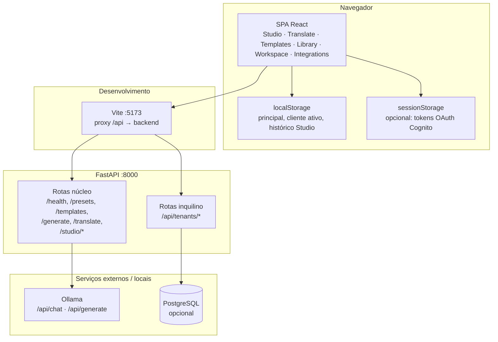
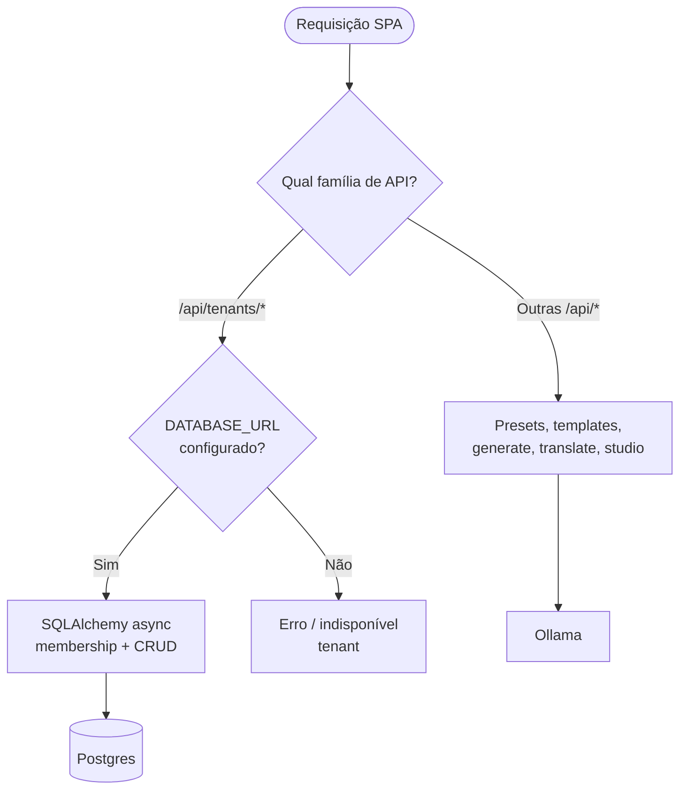
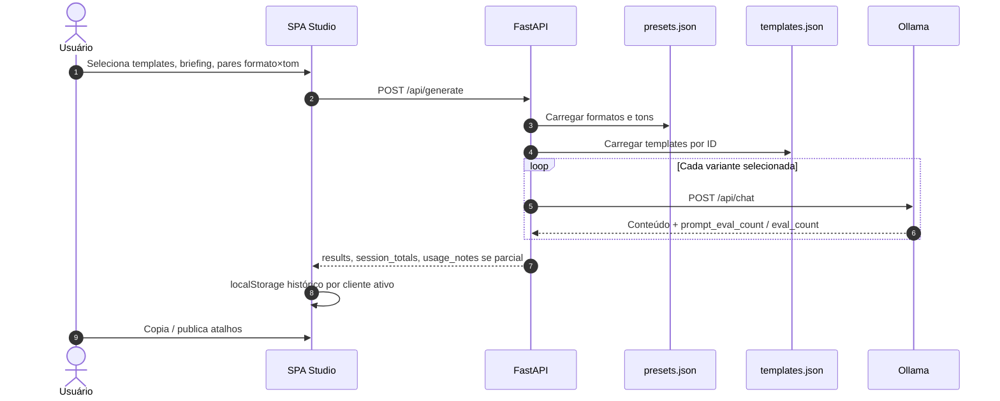
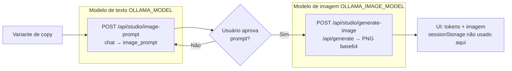
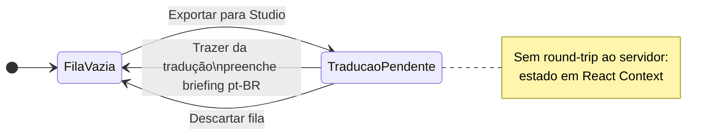
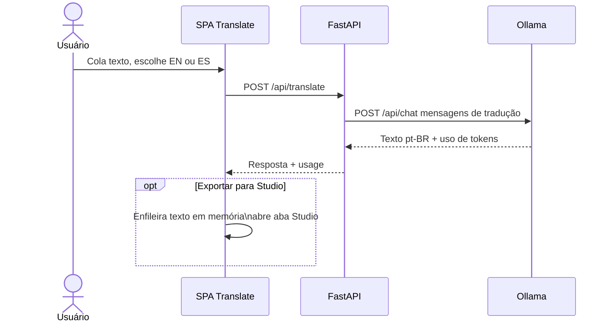
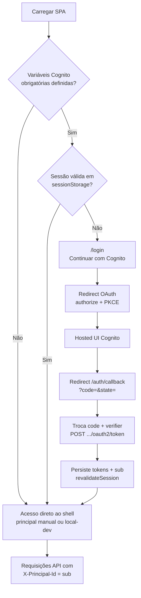
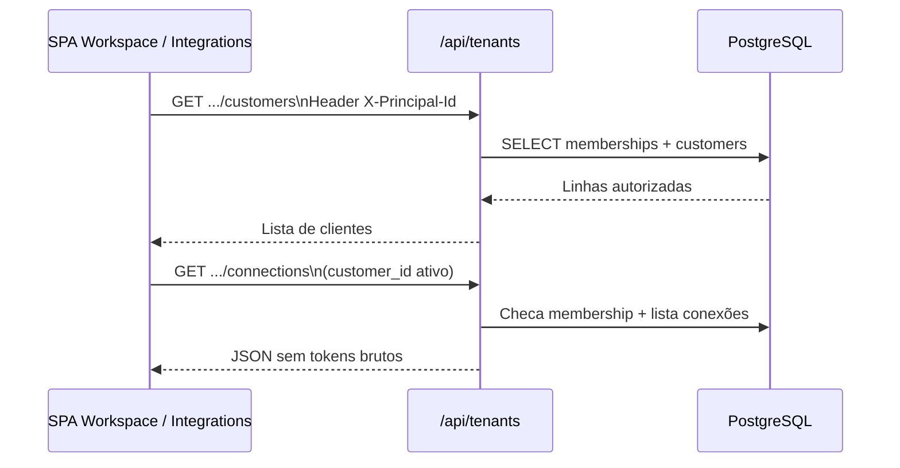
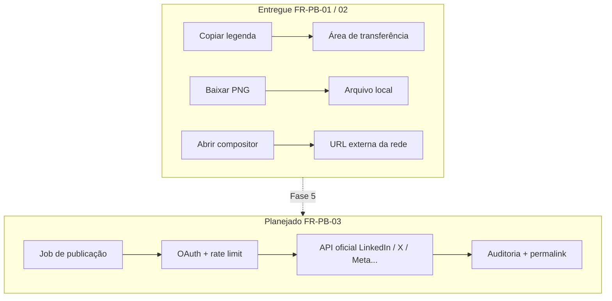
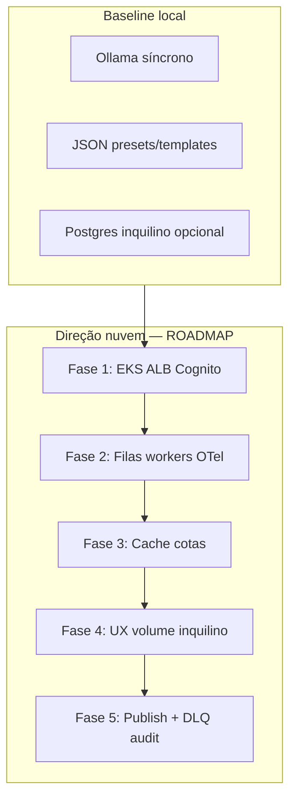

# GIGI-AI — Documento de requisitos de produto (PRD)

**Idioma:** português (Brasil). Os arquivos técnicos citados (README, ROADMAP, etc.) permanecem no idioma original no repositório.

| Campo | Valor |
|--------|--------|
| **Produto** | GIGI-AI (qwen-social-studio) |
| **Tipo de documento** | PRD — alinhamento executivo e engenharia |
| **Status** | Documento vivo; reflete o repositório na forma implementada, salvo quando uma seção estiver explicitamente marcada como *Planejado*. |
| **Fontes principais** | [README.md](../README.md), [ROADMAP.md](./ROADMAP.md), [USER_GUIDE.md](./USER_GUIDE.md), [INTEGRATIONS_PLATFORMS.md](./INTEGRATIONS_PLATFORMS.md), [IMAGE_GENERATION.md](./IMAGE_GENERATION.md), [LOCAL_POSTGRES.md](./LOCAL_POSTGRES.md) |

**Como usar este arquivo:** Executivos leem §1–3, §6, §12–14, §16 e **§18 (diagramas)**. Produto le §4–11. Engenharia le §8–11, §13, §15–17 e **§18 (Mermaid)**. Parceiros de integração focam em §10–11 e em [INTEGRATIONS_PLATFORMS.md](./INTEGRATIONS_PLATFORMS.md). Links externos estão em **§19**.

---

## 1. Resumo executivo

**GIGI-AI** é uma **aplicação web local-first** para produção de **copy para redes sociais e marketing**, dimensionada em relação a uma única máquina: o usuário define **formatos** e **tons**, associa **templates de guardrail**, informa um **briefing** e recebe uma **matriz de variantes** gerada via **Ollama** (pilha de texto padrão: modelos classe Qwen, ex.: `qwen2.5:14b`). Há **tradução** opcional (inglês ou espanhol → português do Brasil), **sugestão de prompt de imagem** e **geração de imagem** (modelo de imagem Ollama separado) e, com **PostgreSQL** habilitado, um **espaço de trabalho multi-cliente** com **cadastro de conexões sociais por cliente**, preparando o produto para **operação em equipe** e **publicação futura no servidor**.

O código é estruturado de propósito para **dois níveis de implantação sustentados** descritos no roadmap: **Local** (experiência principal hoje) e **Cloud** (EKS, Cognito, filas, cache compartilhado — *planejado* como infraestrutura, não totalmente entregue neste estado do repositório).

---

## 2. Declaração do problema

| Dor | Resposta do produto hoje |
|-----|---------------------------|
| Prompting ad hoc gera **voz inconsistente** entre canais | **Presets** (formatos × tons) e **amostras** opcionais codificam estrutura e tom repetíveis. |
| Regras de marca e compliance são **redigitadas** a cada campanha | **Templates** (guardrails, estrutura/amostra opcionais) são reutilizados e aplicados por execução de geração. |
| Autores precisam de **muitas variantes** rapidamente | **Studio** gera todos os pares formato×tom selecionados em um ciclo orquestrado de requisições. |
| Mercado brasileiro precisa de **rascunhos localizados** | **Translate** produz pt-BR; **ponte para o Studio** evita fluxo duplicado de copiar/colar. |
| Ativos visuais ficam desacoplados do texto | **Sugestão de prompt de imagem** (chat) + **geração de imagem** (`/api/generate`) permitem criativos opcionais por variante. |
| Agências precisam de **limites por cliente** antes de publicar | **Clientes**, **membros** e **conexões** no Postgres modelam isolamento de inquilino na camada de metadados. |
| Publicação não pode ser acoplada sem disciplina de identidade | **Contrato de integração tipado** por plataforma (URNs, IDs numéricos) antes de automação pesada em OAuth. |

---

## 3. Visão, princípios e objetivos estratégicos

### 3.1 Visão

Permitir **produção de conteúdo em alto volume e sob governança** — local para privacidade e pilotos, nuvem para concorrência e recursos compartilhados da organização — sem bifurcar a **UX de autoria** (Studio, templates, presets).

### 3.2 Princípios de produto (do roadmap, condensados)

1. **Dois níveis sustentados** — Local e nuvem são compromissos; trabalho em nuvem não pode quebrar silenciosamente setups locais profissionais.
2. **Isolamento do inquilino primeiro** — Dados escopados por cliente antes de publicação automatizada ampla.
3. **Observável por padrão** — Falhas estruturadas e visibilidade de tokens; na nuvem, expandir para traces e métricas de jobs.
4. **Entrega progressiva** — Entregar perfis de implantação e contratos antes de otimizar cada linha de cache.
5. **Contratos compartilhados, backends intercambiáveis** — APIs HTTP e formatos de metadados estáveis; adaptadores mudam (fila, cache, auth).

### 3.3 Objetivos estratégicos (mensuráveis de forma direcional)

| ID | Objetivo | Indicador / nota |
|----|----------|------------------|
| **O-1** | Paridade de **implantação dupla** | Mesmas telas centrais e contratos de API nos perfis Local vs nuvem (`DEPLOYMENT` / feature flags *planejado*). |
| **O-2** | **Escala estruturada** | Formatos, tons e templates versionados no repositório ou admin apoiado em BD (*hoje: arquivos JSON + API*). |
| **O-3** | **Confiança** | Cognito opcional na UI hoje; **validação de JWT na API** e ALB OIDC *planejados* para rotas privilegiadas. |
| **O-4** | **Vazão (âncora na nuvem)** | Dimensionar para **~10M de tokens consumidos/dia** em agregado com filas e escala de workers — **modelo de capacidade**, não SLA de nó único. |
| **O-5** | **Distribuição** | Registro + atalhos de publicação na UI **implementados**; **pipeline de publicação no servidor** *planejado* (Fase 5). |

---

## 4. Usuários-alvo e personas

| Persona | Necessidades | Superfícies do produto |
|---------|--------------|-------------------------|
| **Criador solo / PMM** | Variantes rápidas, copiar para área de transferência, governança leve | Studio, Translate, Library, Templates |
| **Operador de agência** | Muitas marcas, separação clara, metadados de integração | Workspace, Integrations, histórico escopado por cliente |
| **Engenharia / TI** | Instalação reproduzível, health checks, BD opcional | INSTALLATION, LOCAL_POSTGRES, `/api/health`, Swagger `/docs` |
| **Segurança / compliance** | Residência de dados, autenticação, trilha de auditoria | Portão Cognito na UI (*opcional*); registro de uso de tokens no Postgres (*eventos de workspace*); roadmap de auditoria na publicação |

---

## 5. Escopo

### 5.1 Dentro do escopo (implementado)

- SPA React: **Studio**, **Translate**, **Templates**, **Library** (JSON de presets), **Workspace**, **Integrations**.
- FastAPI: health, CRUD de presets, CRUD de templates, **generate**, **translate**, **studio image-prompt**, **studio generate-image**.
- API de inquilino (com `DATABASE_URL` definido): clientes, membros, conexões, agregação de uso de tokens por janela, db-health.
- Integração Ollama: conclusões de chat + T2I de imagem; campos de uso mesclados quando a Ollama os retorna.
- UI opcional com **Cognito** (PKCE + hosted UI); principal alinhado ao `sub` quando há sessão.
- **UX de publicação**: copiar legenda, baixar PNG, abrir URLs externas do compositor — **sem** POST nas APIs das redes.

### 5.2 Fora do escopo (não metas explícitas hoje)

- **Postagem no servidor** nas APIs LinkedIn, X, Instagram, Facebook.
- **Cobrança de marketplace de inferência** gerenciada dentro do app (sem medidor de tokens na nuvem).
- **Apps nativos móveis**.
- **Colaboração em tempo real** (multi-cursor, coedição ao vivo).
- **JWT obrigatório em todas as rotas FastAPI** (cabeçalho `X-Principal-Id` permanece o mecanismo de identidade do inquilino salvo extensão futura).

### 5.3 Escopo futuro (respaldado pelo roadmap, sem datas garantidas)

- EKS, ALB, WAF, Secrets Manager; filas de jobs SQS (ou equivalente); cache estilo Redis; workers completos de refresh OAuth; DLQ de jobs de publicação e UI de auditoria.

---

## 6. Métricas de sucesso (produto e plataforma)

| Métrica | Definição | Baseline / ferramenta |
|---------|-----------|------------------------|
| **Tempo até a primeira variante** | Usuário obtém primeira saída aceitável do Studio após instalação | INSTALLATION + smoke: health + um generate |
| **Vazão de variantes** | Pares gerados por minuto de relógio | Limitado pelo hardware da Ollama; documentar máximo recomendado de pares localmente |
| **Adoção de governança** | % de execuções com ≥1 template (*sem analytics in-app hoje — observação manual*) | *Planejado:* persistência de metadados de execução |
| **Prontidão multi-inquilino** | Clientes + conexões criáveis sem vazamento cruzado | Checagens de membership na API + matriz de QA manual |
| **Correção de integração** | Payloads de plataforma inválidos rejeitados na API | Validadores de schema em `social_platforms.py` |
| **Confiabilidade** | Erros da API exibidos na UI | Banners visíveis ao usuário + Swagger para JSON bruto |
| **Âncora na nuvem** | Infra suporta meta agregada de tokens | Modelagem **~10M tokens/dia** conforme ROADMAP |

---

## 7. Jornadas do usuário (nível de requisitos)

### 7.1 Studio: briefing → matriz → saída

1. Usuário seleciona **template_ids** (opcional, a partir da lista no servidor).
2. Usuário informa **briefing**, **idioma de saída** e **temperatura**.
3. Usuário seleciona pares **formato × tom** dos presets.
4. Usuário aciona **Generate** → backend monta mensagens por variante → chat Ollama por variante → **results** agregados + **session_totals** + **usage_notes** quando contagens incompletas.
5. Usuário pode **Sugerir prompt de imagem** → **Gerar imagem** por variante; uso de tokens exibido para as pernas texto e imagem quando disponível.
6. Usuário **publica** via área de transferência / download / link externo; contexto opcional de cliente a partir do Workspace.

**Aceite:** Todas as etapas funcionam com Ollama acessível; degradação aceitável quando o BD de inquilino está offline (o Studio ainda gera).

### 7.2 Translate → repasse ao Studio

1. Usuário traduz EN/ES → pt-BR.
2. Usuário **Exporta para o Studio** (fila apenas no cliente).
3. No Studio, **Trazer da tradução** preenche o briefing e define idioma de saída para pt-BR.

**Aceite:** Sem ida-volta ao servidor para a fila; descartar limpa a fila sem alterar o briefing até confirmação do usuário.

### 7.3 Workspace e Integrations (Postgres ligado)

1. Usuário define **principal** (`X-Principal-Id` ou `sub` do Cognito quando autenticado).
2. Usuário cria ou seleciona **cliente**; membership aplicada na API.
3. Usuário registra **conexões** com payloads tipados por plataforma.
4. O Studio carrega conexões para atalhos de publicação quando cliente + API estão saudáveis.

**Aceite:** Não-membro recebe erro; tokens nunca retornados no JSON (apenas booleanos mascarados).

---

## 8. Requisitos funcionais

Notação: **REQ-ID** — **Prioridade** (P0 obrigatório, P1 desejável, P2 opcional) — **Status** (*Entregue* / *Parcial* / *Planejado*).

### 8.1 Geração de conteúdo (Studio)

| ID | Requisito | P | Status |
|----|-----------|---|--------|
| **FR-S-01** | O sistema deve gerar **uma variante por par formato×tom** selecionado a partir de uma única ação **Generate**. | P0 | *Entregue* |
| **FR-S-02** | O sistema deve injetar **guardrails de template** selecionados de forma que **prevaleçam** sobre formato/tom em conflitos de segurança/marca (nível de prompt). | P0 | *Entregue* |
| **FR-S-03** | O usuário deve definir **idioma de saída** e **temperatura** por execução. | P0 | *Entregue* |
| **FR-S-04** | O sistema deve retornar **uso de tokens por variante** quando a Ollama fornecer `prompt_eval_count` / `eval_count`, além de **agregado da sessão** e **notas** quando parcial. | P1 | *Entregue* |
| **FR-S-05** | O usuário deve **recarregar presets/templates** pela API sem recarregar a página inteira. | P1 | *Entregue* |
| **FR-S-06** | O sistema deve persistir **histórico de geração** no armazenamento do navegador chaveado pelo **cliente ativo** quando definido. | P1 | *Entregue* |
| **FR-S-07** | O usuário deve obter **sugestão de prompt de imagem** a partir do texto da variante social via modelo de chat. | P1 | *Entregue* |
| **FR-S-08** | O usuário deve **gerar imagem raster** a partir do prompt aprovado via **modelo de imagem** configurado (`OLLAMA_IMAGE_MODEL`). | P1 | *Entregue* |
| **FR-S-09** | O sistema deve exibir **uso de tokens para image-prompt e generate-image** na UI e registro opcional no workspace quando cliente + principal permitirem. | P1 | *Entregue* |

### 8.2 Tradução

| ID | Requisito | P | Status |
|----|-----------|---|--------|
| **FR-T-01** | O sistema deve traduzir texto de **inglês ou espanhol** para **português do Brasil** via contrato dedicado `/api/translate`. | P0 | *Entregue* |
| **FR-T-02** | O sistema deve expor **uso de tokens** nas respostas de tradução quando disponível. | P1 | *Entregue* |
| **FR-T-03** | O usuário deve exportar a tradução para o Studio via **ponte em memória** (sem chamada extra de API para enfileirar). | P1 | *Entregue* |

### 8.3 Presets e templates (autoria)

| ID | Requisito | P | Status |
|----|-----------|---|--------|
| **FR-P-01** | O sistema deve **ler/escrever** `presets.json` via `/api/presets` com validação. | P0 | *Entregue* |
| **FR-P-02** | O sistema deve **CRUD** de templates em `templates.json` via `/api/templates` com IDs estáveis. | P0 | *Entregue* |
| **FR-P-03** | Cada formato/tom pode incluir string **sample** usada como referência não literal nos prompts. | P1 | *Entregue* |

### 8.4 Workspace multi-cliente (Fase 4)

| ID | Requisito | P | Status |
|----|-----------|---|--------|
| **FR-W-01** | O sistema deve expor **REST** para clientes e memberships escopados pelo cabeçalho **principal**. | P0 | *Entregue* (exige BD) |
| **FR-W-02** | Somente membros podem ler o cliente; somente **admin** pode excluir cliente ou ações administrativas destrutivas conforme o roteador. | P0 | *Entregue* |
| **FR-W-03** | O sistema deve registrar **eventos de uso de tokens do workspace** quando `customer_id` + membership forem satisfeitos nas rotas studio/translate/imagem. | P1 | *Entregue* |
| **FR-W-04** | O sistema deve expor **uso de tokens agregado** por janela de tempo para um cliente. | P1 | *Entregue* |
| **FR-W-05** | O campo principal deve ser **somente leitura na UI** com Cognito habilitado, originado do `sub`. | P1 | *Entregue* |

### 8.5 Registro de integrações

| ID | Requisito | P | Status |
|----|-----------|---|--------|
| **FR-I-01** | O sistema deve suportar as plataformas **`linkedin`**, **`x`**, **`instagram`**, **`facebook`**. | P0 | *Entregue* |
| **FR-I-02** | A API deve **rejeitar** payloads de create/patch que omitam campos de identidade tipados obrigatórios para a plataforma selecionada. | P0 | *Entregue* |
| **FR-I-03** | A API deve **normalizar** identidade em `connection_metadata` incluindo marcadores de versão do contrato. | P0 | *Entregue* |
| **FR-I-04** | A API **nunca deve retornar** tokens OAuth brutos; apenas booleanos ou metadados não secretos conforme schemas. | P0 | *Entregue* |
| **FR-I-05** | O operador pode registrar a string **`oauth_scopes_granted`** para auditoria (o servidor não revalida contra catálogos do fornecedor). | P2 | *Entregue* |

### 8.6 Autenticação (UI)

| ID | Requisito | P | Status |
|----|-----------|---|--------|
| **FR-A-01** | Com variáveis de ambiente Cognito completas, a SPA deve **exigir login** em todas as rotas do app exceto `/login` e `/auth/callback`. | P1 | *Entregue* |
| **FR-A-02** | O login deve usar **OAuth 2.0 authorization code + PKCE** contra a hosted UI do Cognito. | P1 | *Entregue* |
| **FR-A-03** | Tokens devem residir em **`sessionStorage`** (escopo da aba); logout deve limpar a sessão do app e chamar a URL de logout do Cognito. | P1 | *Entregue* |
| **FR-A-04** | O backend deve validar **JWT do Cognito** nas rotas de inquilino e studio. | P1 | *Planejado* |

### 8.7 Publicação

| ID | Requisito | P | Status |
|----|-----------|---|--------|
| **FR-PB-01** | O usuário deve copiar o texto do post e, opcionalmente, baixar a imagem gerada a partir do Studio. | P0 | *Entregue* |
| **FR-PB-02** | O usuário deve abrir **URLs do compositor** específicas da plataforma a partir da UI de publicação. | P1 | *Entregue* |
| **FR-PB-03** | O sistema deve **postar** conteúdo via APIs oficiais das redes com retentativas, limites de taxa e trilha de auditoria. | P0 | *Planejado* (Fase 5) |

---

## 9. Requisitos não funcionais

| ID | Categoria | Requisito | Status |
|----|-----------|-----------|--------|
| **NFR-01** | Desempenho | **Generate** e **Translate** devem tolerar chamadas longas à Ollama; **timeout de requisição** padrão configurável (ex.: 600s nas settings). | *Entregue* |
| **NFR-02** | Desempenho | O nível local deve documentar **máximo recomendado de variantes concorrentes** para evitar OOM/sobrecarga de CPU (*documentação parcial em USER_GUIDE / README*). | *Parcial* |
| **NFR-03** | Segurança | APIs de inquilino devem aplicar **membership** em toda rota escopada por cliente. | *Entregue* |
| **NFR-04** | Segurança | Implantações de produção devem **criptografar segredos em repouso** e usar gerenciador de segredos (*orientação no ROADMAP; não imposto no código*). | *Planejado* |
| **NFR-05** | Segurança | A SPA deve mitigar **CSRF no callback OAuth** via validação de `state` e verificador PKCE. | *Entregue* |
| **NFR-06** | Confiabilidade | A API deve expor **`/api/health`** incluindo configuração de modelos para o pill de status na UI. | *Entregue* |
| **NFR-07** | Manutenibilidade | Caminhos de presets/templates devem ser **configuráveis** por ambiente para flexibilidade de implantação. | *Entregue* |
| **NFR-08** | Observabilidade | Traces e métricas **por job** estruturados no nível nuvem | *Planejado* (Fase 2) |

---

## 10. Dados e persistência

| Armazenamento | Conteúdo | Ciclo de vida |
|---------------|----------|----------------|
| **`data/presets.json`** | Formatos, tons, amostras | Git + gravações via API a partir da Library |
| **`data/templates.json`** | Pacotes de guardrail | Git + gravações via UI de Templates |
| **`localStorage` (navegador)** | Id do principal, id do cliente ativo, histórico do studio | Dispositivo do usuário |
| **`sessionStorage` (navegador)** | Tokens OAuth Cognito quando habilitado | Sessão da aba |
| **PostgreSQL** | Clientes, membros, conexões sociais, eventos de uso de tokens do workspace | BD operado pela organização |

**Restrição:** A geração do Studio ainda **não** lê presets customizados **por cliente** a partir do BD (*caminho único de presets para inferência hoje* — alinhar ao roadmap se for exigido conteúdo escopado por inquilino).

---

## 11. Superfície da API (resumo de contrato)

### 11.1 API principal (`backend/app/main.py`)

| Método | Caminho | Finalidade |
|--------|---------|--------------|
| GET | `/api/health` | Tags de modelo, URL base da Ollama, modelo de imagem |
| GET / PUT | `/api/presets` | Ler/escrever JSON de presets |
| GET / POST / PUT / DELETE | `/api/templates` (+ id) | CRUD de templates |
| POST | `/api/generate` | Geração em matriz do Studio |
| POST | `/api/translate` | EN/ES → pt-BR |
| POST | `/api/studio/image-prompt` | Sugestão de prompt de imagem (chat) |
| POST | `/api/studio/generate-image` | T2I (`/api/generate` no modelo de imagem) |

### 11.2 API de inquilino (`/api/tenants/...`, `tenants.py`)

| Método | Caminho | Finalidade |
|--------|---------|--------------|
| GET | `/api/tenants/db-health` | Teste de conectividade do BD |
| POST | `/api/tenants/customers` | Criar cliente + membership admin |
| GET | `/api/tenants/customers` | Listar clientes do principal |
| GET / PATCH / DELETE | `/api/tenants/customers/{id}` | Ler, atualizar, excluir |
| GET | `/api/tenants/customers/{id}/usage/tokens` | Agregados de tokens |
| POST / GET / PATCH / DELETE | `/api/tenants/customers/{id}/connections[...]` | CRUD de conexões |

**Cabeçalho de identidade:** `X-Principal-Id` (padrão `local-dev` quando omitido em desenvolvimento).

---

## 12. Integrações — detalhe de requisitos de produto

### 12.1 Regras de contrato (normativas)

Cada linha de conexão é **uma** tupla `(customer_id, platform, canonical_external_id)` com payload de identidade **tipado** validado no servidor. Ver **[INTEGRATIONS_PLATFORMS.md](./INTEGRATIONS_PLATFORMS.md)** para matrizes de campos e links oficiais.

| Plataforma | Identidade obrigatória | Chave de unicidade |
|------------|------------------------|---------------------|
| **LinkedIn** | `author_urn` (`urn:li:person:{id}` ou `urn:li:organization:{id}`) | URN |
| **X** | `user_id` (apenas dígitos) | User ID |
| **Instagram** | `facebook_page_id` + `instagram_user_id` | IG user id |
| **Facebook** | `page_id` | Page id |

### 12.2 Critérios de aceite (integrações)

- **IA-1:** POST com formato errado para a plataforma retorna **4xx** com mensagem de validação acionável.
- **IA-2:** GET de conexão nunca inclui **`access_token` / `refresh_token`** brutos no JSON.
- **IA-3:** Linhas legadas sem metadados tipados permanecem legíveis até o operador aplicar PATCH ao novo contrato (*caminho de migração documentado*).

### 12.3 Meta de volume de desenho

- **≥20 contas por plataforma por cliente** sem novas tabelas por rede (*UX no roadmap*: busca, filtros, ações em massa).

---

## 13. Roadmap — entregas por fase e critérios de saída

Alinhado a **[ROADMAP.md](./ROADMAP.md)**; datas omitidas de propósito.

| Fase | Entregas | Critérios de saída (resumo) |
|------|----------|-----------------------------|
| **1 — Fundação na nuvem** | EKS, ingress, ALB (+ WAF opcional), Cognito, segredos | Caminho autenticado até o app; tier sem estado escalável; sem API privilegiada anônima |
| **2 — Orquestração** | Filas, workers, idempotência, OpenTelemetry | N jobs concorrentes; status/falhas de job visíveis |
| **3 — Cache e custo** | Chaves de cache escopadas por inquilino, TTLs, cotas | Taxa de acerto em caminhos quentes; aplicação de cotas |
| **4 — Multi-cliente** | Hierarquia, isolamento, UX de volume | **Parcialmente entregue:** Postgres + REST + UI; endurecimento e escopo em andamento |
| **5 — Publicação** | Refresh OAuth, jobs de publicação, DLQ, auditoria | ≥1 rede com publicação E2E com registro de auditoria |

**Âncora de vazão (nuvem):** ~**10M tokens/dia** em agregado — dimensionar profundidade de fila, número de workers e matemática de cotas a partir de tokens/job medidos e latência p95 (*pré-requisito: métricas da Fase 2*).

---

## 14. Modelo de capacidade

### 14.1 Nível local (atual)

- **Gargalo:** instância única da Ollama (CPU/GPU), processo único do FastAPI para geração síncrona.
- **Insumos de dimensionamento:** tamanho do modelo, número de variantes, geração de imagem ligada/desligada, `REQUEST_TIMEOUT_S`.
- **Expectativa de UX:** vazão e latência **degradam de forma explícita** sob sobrecarga; documentar recomendações de concorrência (*NFR-02 Parcial*).

### 14.2 Nível nuvem (direcional)

- **Vazão:** `jobs/s × tokens/job × 86400` deve caber em **pool de inferência + taxa de drenagem da fila**.
- **Pico:** multiplicador de pico vs regime permanente determina **profundidade SQS**, **máximo de workers**, política de **autoscaling**.
- **Econômico:** APIs cobradas por token vs horas-GPU self-hosted; cache altera margem (*Fase 3*).

### 14.3 Metadados

- O schema Postgres suporta cardinalidade crescente de conexões; adicionar índices quando endpoints de lista apresentarem latência em escala.

---

## 15. Dependências e premissas

| Dependência | Premissa |
|---------------|----------|
| **Ollama** | Acessível em `OLLAMA_BASE_URL`; modelos obtidos com `pull` compatíveis com `OLLAMA_MODEL` / `OLLAMA_IMAGE_MODEL`. |
| **Python** | 3.11 ou 3.12 suportados para o venv do backend (3.14 pode não ter wheels, conforme README). |
| **Node** | ≥20 para a cadeia de ferramentas do frontend. |
| **Postgres** | Opcional; `DATABASE_URL` vazio desabilita rotas de inquilino conforme implementado nas settings. |
| **Cognito** | Quando habilitado, o operador configura app client público (PKCE), URLs de callback e de logout. |
| **Navegadores** | Evergreen modernos; uso de `crypto.subtle` para PKCE e `sessionStorage` para tokens. |

---

## 16. Riscos e mitigações

| Risco | Impacto | Mitigação |
|-------|---------|-----------|
| Ollama omite contagens de tokens | Relatórios de capacidade enganosos | **usage_notes** na UI; documentar comportamento de cache; futura medição a partir de logs no servidor |
| Sem JWT na API | `X-Principal-Id` falsificável se a rede for exposta | **Não expor** a API publicamente sem camada de auth; implementar FR-A-04 + ALB OIDC na nuvem |
| Tokens no BD das conexões | Vazamento se o BD for comprometido | Roadmap: criptografia + Secrets Manager; minimizar escopos hoje |
| StrictMode / callback OAuth | Troca dupla do código | Deduplicação por promise single-flight no callback da SPA |
| Teto de máquina única | SLAs de agência não atendidos só no local | Posicionar tier nuvem + filas; alinhar expectativas com o cliente |

---

## 17. Decisões em aberto (log)

| Tópico | Opções | Recomendação |
|--------|--------|---------------|
| Presets escopados por inquilino | JSON global vs presets por cliente no BD | Decidir antes de multi-marca enterprise |
| Estratégia de modelo de imagem | Tags Ollama vs serviço HF externo | Ver IMAGE_GENERATION.md |
| Unificação de auth | Somente Cognito vs cabeçalho de dev | Política baseada em ambiente |

*Mantenedores: acrescentem linhas com `AAAA-MM-DD` quando as decisões forem encerradas.*

---

## 18. Diagramas — fluxo e lógica (Mermaid)

Diagramas alinhados às jornadas dos §§7–11 e ao escopo do §5. Renderização: GitHub, VS Code (extensão Mermaid), ou [mermaid.live](https://mermaid.live).

### 18.1 Visão geral do sistema

Fluxo de componentes: SPA, API núcleo, API de inquilino, Ollama e Postgres opcional.

### 18.2 Lógica de implantação: núcleo sempre ativo, inquilino condicional

### 18.3 Sequência — geração no Studio (matriz de variantes)

### 18.4 Fluxo — sugestão e geração de imagem por variante

### 18.5 Estado — ponte Translate → Studio (somente cliente)

### 18.6 Sequência — Tradução para pt-BR

### 18.7 Fluxo — autenticação opcional (Amazon Cognito + PKCE)

### 18.8 Sequência — Workspace: cliente ativo e conexões

### 18.9 Fluxo lógico — publicação hoje (sem API de rede)

### 18.10 Roadmap em camadas (lógica de evolução)

---

## 19. Referências

| Documento | Função |
|-----------|--------|
| [USER_GUIDE.md](./USER_GUIDE.md) | Passo a passo alinhado à UI |
| [INSTALLATION.md](./INSTALLATION.md) | Matriz completa de instalação |
| [ROADMAP.md](./ROADMAP.md) | Roadmap longo da plataforma |
| [INTEGRATIONS_PLATFORMS.md](./INTEGRATIONS_PLATFORMS.md) | Contrato de integração |
| [IMAGE_GENERATION.md](./IMAGE_GENERATION.md) | Escolha do modelo de imagem |
| [LOCAL_POSTGRES.md](./LOCAL_POSTGRES.md) | Bootstrap do BD de inquilino |
| [README.md](../README.md) | Diagramas de arquitetura adicionais |

---

*Disciplina de revisão: quando um item **Planejado** for entregue, atualizar §5, colunas de status do §8 e §13; incrementar a tabela do §0 ou acrescentar subseção `CHANGELOG` com data e referência de PR. Atualizar diagramas do §18 quando fluxos mudarem.*
